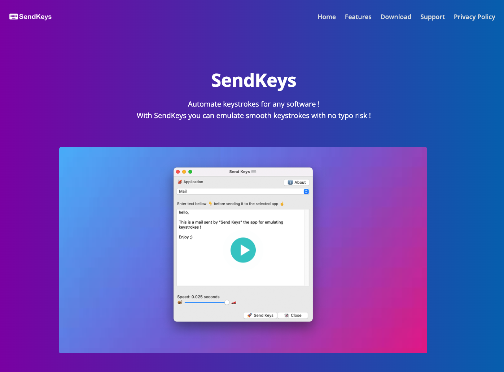

## Hi there 👋 My name is Akram, and I go by @FrenchTechLead on my social media

I'm a software engineer, a tech lead, a mentor, a blogger, a teacher and a nice human being, I guess 😄  
I'm also a Freelance consultant, so don't hesitate to reach out for collaboration.

- 🔭 I’m currently working on a few projects, but I'm mostly focused on my [blog](https://frenchtechlead.com) and my freelance work.
- 🌱 I’m currently learning creating content for my [blog](https://frenchtechlead.com) and my [YouTube channel.](https://www.youtube.com/channel/UCBTwp0DPgh6OICURH4OyAEQ)
- 👯 I’m looking to collaborate on content creation, open source projects, and freelance work.
- 💬 Ask me about anything, I'm happy to help, and I'm always open to new ideas.
- 📫 How to reach me: [Twitter](https://twitter.com/FrenchTechLead), [LinkedIn](https://www.linkedin.com/in/techlead-java-angular/), [YouTube](https://www.youtube.com/channel/UCBTwp0DPgh6OICURH4OyAEQ), [Blog](https://frenchtechlead.com).
- ⚡ Fun fact: most of french 🇫🇷 people don't eat snails 🐌

<h2>Find me at these places</h2>
  
  
  
  
  
  

## My skills

- ✅ Pragramming languages: Java, JavaScript, TypeScript, Python, PHP, SQL, Bash, HTML, CSS, XML, YAML, JSON, Markdown, etc.
- ✅ Frameworks: Spring, Angular, React, Node, Express, Astro, etc.
- ✅ Databases: MySQL, PostgreSQL, MongoDB, Redis, etc.
- ✅ DevOps: Docker, Kubernetes, Git, GitHub, GitLab, Jenkins, CircleCI, etc.
- ✅ Cloud: AWS, Azure.
- ✅ Tools: IntelliJ, VSCode, Postman, Jira, Confluence, etc.

## My projects

- 📚 [My blog](https://frenchtechlead.com) where I write about software engineering, tech lead, and other topics.
- 📺 [My YouTube channel](https://www.youtube.com/channel/UCBTwp0DPgh6OICURH4OyAEQ) In progress...
- 📝 [My newsletter](https://frenchtechlead.us10.list-manage.com/subscribe/post?u=18ec3b3f8638062e5a576682b&id=120ed2a396) to stay in touch 💙

## Support My Work

## Showcase

<table>
    <thead>
        <tr>
            <th>Project</th>
            <th>screenshot</th>
        </tr>
    </thead>
    <tbody>
        <tr>
            <td>
                <strong>bienparler.fr</strong> 
                bienparler.fr is a french 🇫🇷 website where you can entrer simple sentences and get alternave ones suited for a more formal context.
            </td>
            <td>
                
            </td>
        </tr>
        <tr>
            <td>
                <strong>frenchtechlead.com</strong> 
                frenchtechlead.com is my blog where I write about software engineering, tech lead, and other topics.
            </td>
            <td>
                
            </td>
        </tr>
        <tr>
            <td>
                <strong>HTTP-SNITCH</strong> 
                HTTP-SNITCH is a mini HTTP server that prints out every requests that it receives, it&#39;s useful for debugging all kinds of HTTP clients and reverse proxies/ load balancers.
            </td>
            <td>
                
            </td>
        </tr>
        <tr>
            <td>
                <strong>Robusta</strong> 
                Robusta is a basic programming language based on java, it was designed for learning the basics of software programming without the hasle of the advanced principles and hard configurations, it&#39;s being thought in the
                french 🇫🇷 university UPEC (Paris 12).
            </td>
            <td>
                
            </td>
        </tr>
        <tr>
            <td>
                <strong>SendKeys</strong> 
                SendKeys is a productivity tool for macOS, it makes it possible to send virtual keystrokes from a pre-defined text.
            </td>
            <td>
                
            </td>
        </tr>
    </tbody>
</table>